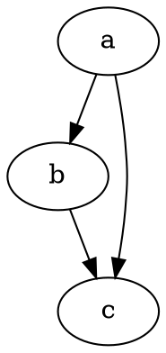

# GPT RENDER: Graphviz diagram renderer for GPT responses in Firefox and Chrome

Right-click on a DOT code block in any web page (including ChatGPT) and render it to SVG in a lightweight in-page popup.

## Features

- Context menu entry: render selection or the nearest code block
- In-page SVG popup with Close button
- Offline Graphviz via `viz.js` with `full.render.js` worker
- Diagnostics check from background to content: scheme support, `viz.js` present, worker reachable
- Modular content router and UI host ready for more renderers

## Project structure

```
gptrender/
├── background.js
├── content.js
├── vendor/
│   ├── viz.js
│   └── full.render.js
├── icons/
└── README.md
```

## Requirements

- Firefox Developer Edition or Firefox Release
- Chrome 116+ (tested on current release)
- No external services required
- npm
- Node 18 or newer

## Install on Firefox (temporary)

1) Open `about:debugging`  
2) This Firefox → Load Temporary Add-on → select your `manifest.json`  
3) Open a normal `https` page  
4) Right-click inside a DOT code block → Graph with Graphviz

Notes on restricted pages:
- Scripts do not run on `about:*`, `addons.mozilla.org`, Reader View, built-in PDF viewer, or `view-source:`. Use a normal `http` or `https` page. `file://` works if your manifest matches file URLs and you enable file access.

## Install on Chrome from a zip

1) Create or download the extension zip  
2) Unzip it to a folder on disk  
3) Visit `chrome://extensions`  
4) Toggle Developer mode on  
5) Click Load unpacked and choose the unzipped folder  
6) Optional: toggle Allow access to file URLs if you want to render on `file://` pages

To update later, replace files in that folder and click Reload on the card in `chrome://extensions`.

## Usage

Two ways to render:

- Highlight any DOT snippet, right click, choose Graph with Graphviz
- Right click inside a code block that contains DOT, choose Graph with Graphviz

A popup appears with the SVG. Close it with the button in the header.

### Sample DOT to test



### HTML-like label note

When using `<TABLE>` labels, you must escape `&` as `&amp;`. The router tries to be forgiving, but it is best practice to write them correctly.

## How it works

- `content.js` listens for background probes and render requests
- Background creates the context menu and sends a GRAPHVIZ_DIAG ping to verify:
  - Page scheme is `http`, `https`, or `file`
  - `window.Viz` is present
  - `vendor/full.render.js` is reachable via `browser.runtime.getURL`
- If checks pass, background sends GRAPHVIZ_RENDER with either the selection or a null payload
- `content.js` finds DOT text when null is provided, renders via `viz.js` and inserts an SVG popup

## Permissions

- `contextMenus` to add the right-click item
- `activeTab` and `tabs` to message content and inject alerts into the page
- `<all_urls>` so the content script can detect code blocks where allowed

## Troubleshooting

- The message says content scripts are not running  
  You are on a restricted page, or the URL scheme is unsupported. Try a normal `https` page. For local files, enable file access.

- Viz is not defined  
  Ensure `vendor/viz.js` loads before `content.js` in `manifest.json`. Reload the extension, then refresh the tab.

- Worker not reachable  
  Confirm `vendor/full.render.js` is present and listed under `web_accessible_resources` in the manifest. Paths must match exactly.

- No popup appears  
  Open the page console. Look for `[Graphviz]` from content or `[Graphviz BG]` from background. Errors will include the reason.

- documentElement is null  
  Ensure content init runs after DOM is ready. Use `DOMContentLoaded` if you start work very early.

## Privacy and security

- Rendering is fully local
- No network requests aside from loading the worker from the extension bundle
- No data leaves the browser

## Roadmap

Optional modules as separate renderers and assets:

- Mermaid (`vendor/mermaid/mermaid.min.js`)
- Cytoscape.js (`vendor/cytoscape/cytoscape.min.js`)
- ECharts (`vendor/echarts/echarts.min.js`)

Additions will require:
- Vendor files under `vendor/`
- Web accessible entries in `manifest.json`
- Detection plus dispatch in `content.js`

## License

- `viz.js` and `full.render.js` are MIT licensed. Keep their headers.
- Repo code is covered by the LICENSE in this project.


