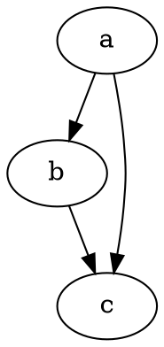

# GPT RENDER: Graphviz-first diagram renderer for Firefox

Right click on a DOT code block in any web page and render it to SVG in a lightweight popup. The code is modular so you can add Mermaid, Cytoscape, and ECharts later without changing the core flow.

## Features

- Context menu entry: render selection or the nearest code block
- Robust cleanup of noisy code blocks from the web (strips "dot", "Copy code", etc.)
- Runs fully offline for Graphviz using `viz.js` and `full.render.js`
- Modular content router and UI host ready for additional renderers

## Project structure

```
gptrender/
├── dist/
│   └── firefox/                # build output (generated)
├── icons/
├── manifests/
│   └── manifest.firefox.json   # Firefox MV2 manifest
├── src/
│   ├── background.firefox.js   # MV2 background
│   ├── content_bootstrap.js    # tiny always-on listener
│   ├── content_router.js       # normalization + detection + dispatch
│   └── renderers/
│       └── renderer_graphviz.js
├── tools/
│   └── build.mjs               # copies sources into dist/firefox
├── ui/
│   ├── popup_host.css
│   └── popup_host.js
├── vendor/
│   └── graphviz/
│       ├── viz.js
│       └── full.render.js
├── package.json
└── README.md
```

## Requirements

- Node 18 or newer
- npm
- Firefox Developer Edition or Release with temporary add-ons
- `web-ext` for convenient run or build
  ```
  npm i -D web-ext
  ```

## Build

Create `dist/firefox` with the correct layout.

```
npm run build:firefox
```

This runs `tools/build.mjs`, which:
- copies `src/` under `dist/firefox/src`
- copies `ui/` and `vendor/`
- copies `manifests/manifest.firefox.json` to `dist/firefox/manifest.json`
- renames `src/background.firefox.js` to `dist/firefox/background.js`

## Run in Firefox

1) Open `about:debugging`  
2) This Firefox → Load Temporary Add-on → select `dist/firefox/manifest.json`  
3) Open a normal https page  
4) Right click inside a DOT code block → Render diagram

Note on restricted pages:
- Extension code will not run on `about:*`, `addons.mozilla.org`, Reader View, built-in PDF viewer, or `view-source:`. Use a normal http or https page for testing. Local files work if `file://` is matched in the manifest and you enable access.

## Usage

Two ways to render:

- Highlight any DOT snippet, right click, choose "Render diagram"
- Right click inside a code block that contains DOT, choose "Render diagram"

A popup will appear with the SVG. Close the popup with the button in the header.

### Sample DOT to test



### HTML-like label note

When using `<TABLE>` labels you must escape `&` as `&amp;`. The router auto-escapes stray ampersands, but it is still best practice to write them correctly.

## How it works

- `content_bootstrap.js` remembers where you right clicked and answers basic probes
- The background injects the UI host and the router on first use in a tab
- The router collects text from selection, context, or a page scan
- The router normalizes the text, detects DOT, runs a preflight, and dispatches to the Graphviz renderer
- The Graphviz renderer uses `viz.js` with the `full.render.js` worker to build an SVG and mount it in the popup host

## Permissions

- `contextMenus` to add the right click item
- `activeTab` and `tabs` to message content and inject scripts
- `<all_urls>` to allow the content bootstrap on any page and to enable rendering wherever permitted

## Roadmap

Planned optional modules, each as a new file under `src/renderers/` with lazy loading from the router:

- Mermaid (`vendor/mermaid/mermaid.min.js`)
- Cytoscape.js (`vendor/cytoscape/cytoscape.min.js`)
- ECharts (`vendor/echarts/echarts.min.js`)

Additions will only require:
- adding files under `vendor/` and `src/renderers/`
- adding the new files to `web_accessible_resources` in the manifest
- extending `detectType` and `routeAndRender` in `src/content_router.js`

## Troubleshooting

- Error: "Cannot initialize on this page"  
  You are on a restricted scheme. Try a normal http or https page.

- Error: "Viz is not defined"  
  Ensure `vendor/graphviz/viz.js` is listed before `src/content_bootstrap.js` in `manifests/manifest.firefox.json`. Rebuild, reload the add-on, then refresh the page.

- Error: "syntax error near 'Copy'"  
  The page code widget text leaked into the payload. The router strips first line noise such as "Copy code" and "dot". If you still see this, select only the DOT snippet and try again.

- No popup appears  
  Open the page console. Look for messages from `[Diagrams]`. Most errors will print the reason.

## Privacy and security

- No endpoints are contacted. Rendering is fully local for Graphviz.
- No credentials or secrets are stored in the repository.
- The extension requests broad URL access but runs code only when you invoke the context menu.

## Licensing

- `viz.js` and `full.render.js` are MIT licensed. Keep their headers intact.
- This repository code is covered by the LICENSE in the project root.

## Contributing

- Keep renderers modular under `src/renderers/`
- Keep all heavy libraries out of `content_scripts`; load them lazily from the router unless they must be present in the content world
- Add new vendor assets under `vendor/` with version pinned filenames when possible

## Short glossary for the nontrivial terms

- Content script: JavaScript that an extension injects into pages, running in an isolated world that is separate from the page window
- Router: The module that extracts text, normalizes it, detects the diagram type, and dispatches to the correct renderer
- Worker: The background execution file used by `viz.js` (`full.render.js`) that performs the Graphviz layout
- DOT: The text language that Graphviz parses to define nodes, edges, and attributes
- Normalization: Cleanup that removes UI noise such as "Copy code" and escapes stray ampersands that would break HTML-like labels
```
